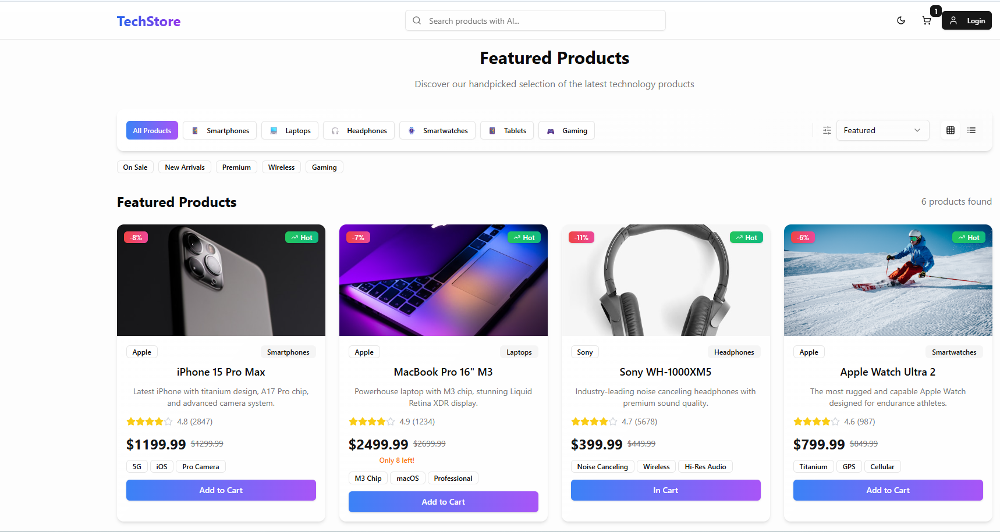
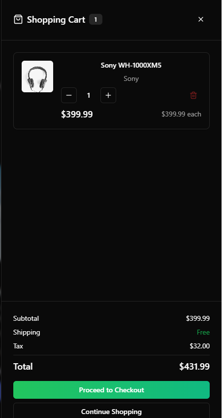

# 🛍️ AI-Powered E-Commerce Platform

A full-stack, intelligent e-commerce platform built with **React** and **Node.js**, enhanced by **OpenAI GPT-4o** for AI-powered product search and personalized recommendations. The application includes a full shopping experience, an admin dashboard, mock checkout, and mobile-first design.

---

## 🚀 Features

### 🛒 Customer Side
- 🛍️ Product Catalog with filtering, sorting, and category navigation
- 🔍 **AI-Powered Search** using GPT-4o (natural language queries)
- 🤖 Personalized product recommendations (collaborative + content-based)
- 🛒 Sliding Cart Sidebar with live total calculations and tax
- ❤️ Wishlist system with cross-sell recommendations
- ⭐ Product Reviews and AI-generated review summaries
- 📦 Order Tracking with status progress
- 🌙 Dark Mode toggle
- 🔐 Email/password login (mocked or Firebase-ready)

---

### 👨‍💼 Admin Dashboard
- 🛠 Product Management: Add/Edit/Delete
- 📦 Order Management with status updates
- 👥 User Management with role support
- 📊 Analytics Dashboard with key metrics (orders, revenue, views)

---

## 🧱 Tech Stack

| Layer       | Technologies |
|-------------|--------------|
| Frontend    | React, Tailwind CSS, Context API, Framer Motion |
| Backend     | Node.js, Express |
| Database    | (Currently JSON/mock data, supports MongoDB or Firebase) |
| AI/NLP      | OpenAI GPT-4o API |
| Auth        | Email/Password Login (mocked/Firebase-ready) |
| Deployment  | Vercel (frontend), Render (backend) |
| DevOps      | GitHub Actions (CI/CD), `.env` support |

---

## 🧪 AI Functionality

- 🔍 **GPT-Powered Product Search**  
  Users can type natural queries like “affordable headphones with noise cancelling” to get precise results.

- 🤖 **Product Recommendation Engine**  
  Uses collaborative and content-based logic to suggest similar or complementary products.

- 🧠 **AI Review Summaries**  
  GPT generates concise, sentiment-aware summaries of customer reviews.

---

## 📂 Project Structure

```
/client             # React frontend
├── components/
├── pages/
├── styles/
└── utils/

/server             # Node.js backend
├── controllers/
├── routes/
├── models/
└── utils/

/data               # JSON-based mock data (products, users, orders)

.env.example        # Environment variable sample
README.md           # Project documentation
```

---

## 🔧 Setup Instructions

### 1. Clone the Repository

```bash
git clone https://github.com/your-username/ai-ecommerce-platform.git
cd ai-ecommerce-platform
```

---

### 2. Setup Environment Variables

Create a `.env` file in the `/server` directory and add your OpenAI key:

```env
OPENAI_API_KEY=sk-your-openai-key
```

---

### 3. Install Dependencies

```bash
# Frontend
cd client
npm install

# Backend
cd ../server
npm install
```

---

### 4. Run Locally

```bash
# Terminal 1 - frontend
cd client
npm run dev

# Terminal 2 - backend
cd server
npm run dev
```

---


## 📸 Screenshots

> Add screenshots of:
- Product Page
  


- Cart Sidebar


   

---


## 📄 License

MIT © [Mohammed Khan]

---

## 👤 Author

**Mohammed Khan**  
[LinkedIn](https://linkedin.com/in/mohammedzkhan) | [GitHub](https://github.com/mzskhan626)

---

